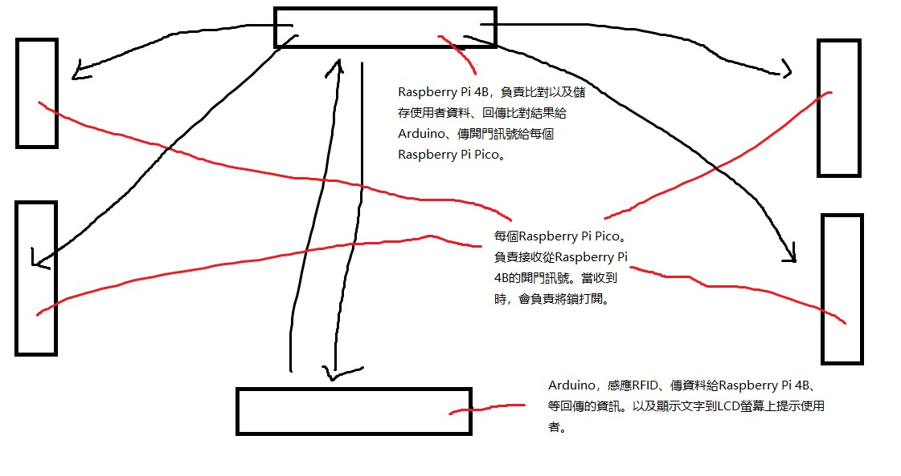

Current architecture planning draft:

    門感應的處理交給Arduino負責，因為Arduino已經有相關函式庫跟例子可以方便我們處理RFID的讀取。

    使用者卡片的資訊記錄存檔，我原本想說EEPROM去存，但應該是不可以這麽做。因為EEPROM根據文獻記載有使用週期，用到特定次數會損壞。我們絕對不能讓卡片使用者的記錄損壞，所以應當要用電腦伺服器去存資料。那這樣的話當然就用樹莓派去負責存資料.

    所以Arduino讀取到卡片的時候就要負責將資料傳給樹莓派，樹莓派再在資料庫進行分析後回傳回給Arduino。有這個使用者的話就進行下一步。如果沒有這個使用者，看是要註冊或否決卡片。

    至於Arduino跟樹莓派的溝通方式，如果用最基本的UART做當然是最輕鬆，可是會顯得很沒實力也不符合物聯網的精神。我覺得最佳理想狀況是透過藍牙或Wifi去接。藍牙跟WIFI的IC模組我都有買，就看到時候測試結果怎麼樣去決定。當然如果到時候無法處理得了的話還是可以改回UART去試.

    好，現在進入下一步。感應完了之後，如果使用者是確定可以使用辦公室的空間，那當然就要開門。可是，如果門不只有一個呢？我覺得這種狀況在開發階段也是需要考量的。這樣的話，我們就應該要把“群組控制”納入考量。意思就是說，應當要有各別門都能控制。我的想法是，控制門的開關可以透過樹莓派去處理，而每一個門都需要有專門的小IC負責去接收資料以及控制鎖的開關。這個時候每個門就可以用一個Raspberry Pi Pico去負責。我們可以透過I2C或SPI，從Raspberry Pi 4B發送資訊到每個Raspberry Pi Pico，進而控制每一道門的開關。

<h1>UPDATE: Everything above is OUTDATED.</h1>
<h3>A new architecture is being planned. There will be a center ESP32 used as access point(router) for all other circuits to make communications with each other.</h3>

TODO:

- The current approach of sending POST from client to server is through URL. But that's extremely bad and makes POST request pointless. This should be re-designed once the project's first version is complete.
Example link of how to change it to correct way: https://randomnerdtutorials.com/esp8266-nodemcu-http-get-post-arduino/