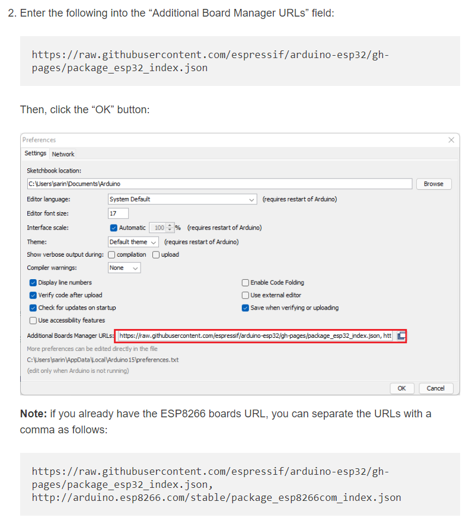
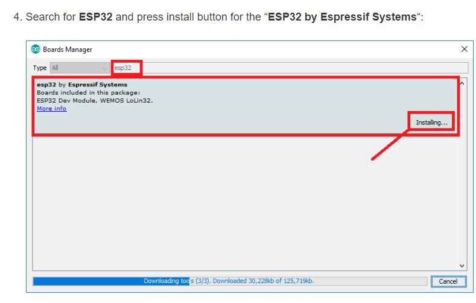

    https://raw.githubusercontent.com/espressif/arduino-esp32/gh-pages/package_esp32_index.json

    https://raw.githubusercontent.com/espressif/arduino-esp32/gh-pages/package_esp32_index.json, http://arduino.esp8266.com/stable/package_esp8266com_index.json

Note:

    If you encountered this error while uploading to ESP32 through Arduino IDE:

        "A fatal error occurred: Failed to connect to ESP32: Wrong boot mode detected (0x13)!"

    You can fix by: Just press BOOT button on the board while uploading.

    Also, it seems that selecting "ESP32C3 Dev Module" is better and more stable than "ESP32 Dev Module" when choosing to upload the code.